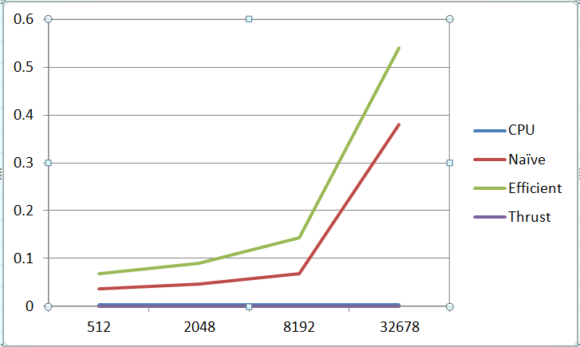
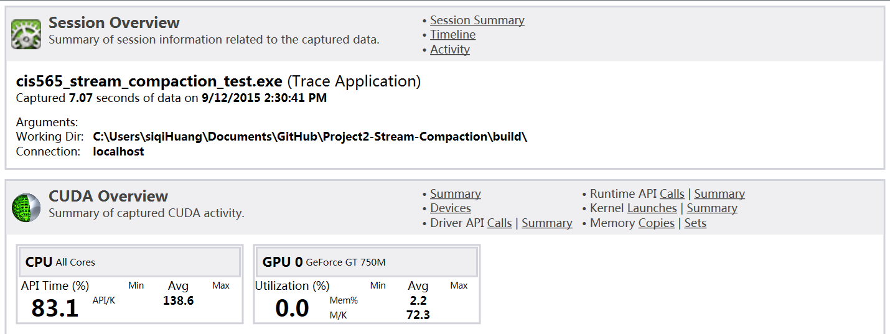
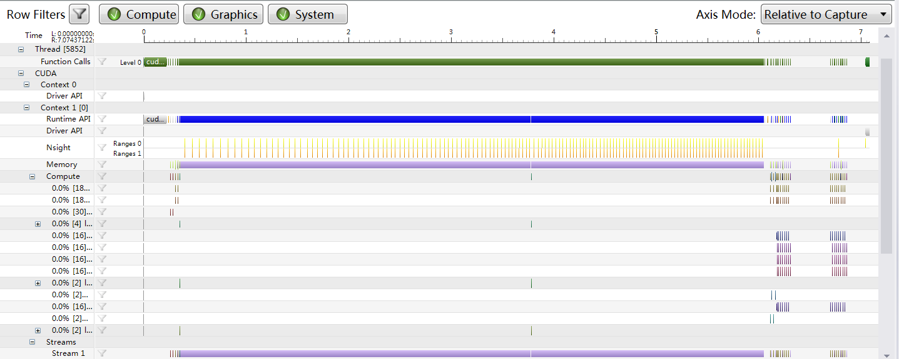

CUDA Stream Compaction
======================

**University of Pennsylvania, CIS 565: GPU Programming and Architecture, Project 2**

siqi Huang Tested on: Windows 7, Inter(R) Core(TM) i7-4870 HQ CPU@ 2.5GHz; GeForce GT 750M(GK107) (Personal Computer)

PART I:
This part is for cpu scan and compaction. The relative code is in cpu.cu.

PART II:
This part is for Naive GPU scan, and the code is in naive.cu. This is not done using shared memory. So multiple kernel is called in the process, and the num is log2(n-1). In each kernel, each thread add a different according to their current state.

PART III:
This part is for Efficient scan and its compaction. This is also not done using shared memory. So I still using multiple kernel. And the num is 2*log(n-1) because both up and down scan takes log(n-1). Each thread work differently in the kernel according to their state. The compaction is like this, first get the 0-1 value of the input, then get the scan, then put right value to right place and copy back.

PART IV:
This part is for thrust scan. The thrust is an enbeded function, so I first copy the input to a vector, then initialize the vector, put it in the GPU and get the result back.

PART V(extra):
This part is for radix sort. The input is n number from 0 to n-1. In my case it is initially sorted from top to bottom. The process of the sort is like this. First get the number of digits, which is the digits of n-1. Then for each digits sort them in parallel. After log(n-1) step, we get the result and copy back. To change the input, you can simply change the number, or customize you own number, but be sure the numbers are consecutive.

Comparsion of several scan methods:

This image shows the time used for each scan method in ms. The CPU uses the same time, do not know if the cuda API is also valid when no kernel is invoked. The thrust basically uses no time, I do not implement it, it may use the shared memory. For the naive scan, it is very surprising to be faster than efficient scan. But since we do not use shared memory, the time to invoke multiple kernel may be much higher than just invoking one. We notice that when the input is small, the naive scan is almost twice as fast as efficient. Then I notice in my implementation, the efficient scan runs excatly on more time of kernel than naive scan(both up and down scan for efficient scan). So if we use shared memory and reduce this disparity, I believe their difference is small. When the input is large in the last case, the efficient case is smaller than half of naive case, which means in one single kernel, the efficient case is faster than the naive case.

Performance:

Those two images are for the 32768 input case. And the output for all input case are in the following files:
"""output/512.txt""","""output/2048.txt""","""output/8192.txt""","""output/32768.txt"""
The test case for radix sort is in the bottom, which contains power of 2 test(256) and non power of 2 test(130)
